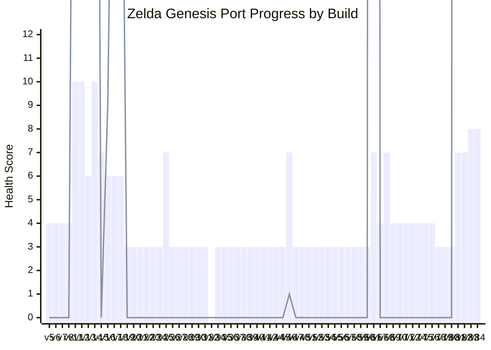

# Zelda Progress Chart

- Reports parsed: `67`
- Best overall score: `v14` (`score=10`, `nmi=58`)
- Highest NMI activity: `v61` (`nmi=299`, `score=7`)
- First build with `VDP display enabled`: `v5`

## Chart

## Per-Build Table

| Build | PASS | FAIL | WARN | Score | NMI | Display | Render | Stuck | PC range |
| --- | ---: | ---: | ---: | ---: | ---: | :---: | :---: | :---: | --- |
| v5 | 8 | 2 | 2 | 4 | 0 | Y | Y | Y | $FFFFFF-$1180F01E |
| v6 | 8 | 2 | 2 | 4 | 0 | Y | Y | Y | $FFFFFF-$1180F026 |
| v7 | 8 | 2 | 2 | 4 | 0 | Y | Y | Y | $FFFFFF-$1180F026 |
| v8 | 8 | 2 | 2 | 4 | 0 | Y | Y | Y | $FFFFFF-$1180F026 |
| v11 | 10 | 0 | 2 | 10 | 43 | Y | Y | N | $00079C-$000F08 |
| v12 | 10 | 0 | 2 | 10 | 43 | Y | Y | N | $00079C-$000EF2 |
| v13 | 8 | 1 | 3 | 6 | 58 | N | N | N | $00076A-$000F16 |
| v14 | 10 | 0 | 2 | 10 | 58 | Y | Y | N | $000414-$000F12 |
| v15 | 9 | 1 | 2 | 7 | 0 | Y | Y | N | $000414-$01518A |
| v16 | 8 | 1 | 3 | 6 | 9 | N | N | N | $000790-$00107A |
| v17 | 8 | 1 | 3 | 6 | 29 | N | N | N | $0003F4-$0010FA |
| v18 | 8 | 1 | 3 | 6 | 29 | N | N | N | $00074C-$0047A6 |
| v19 | 7 | 2 | 3 | 3 | 0 | N | N | N | $0003FE-$015258 |
| v20 | 7 | 2 | 3 | 3 | 0 | N | N | N | $0003FE-$0152AE |
| v21 | 7 | 2 | 3 | 3 | 0 | N | N | N | $0003FE-$0152CE |
| v22 | 7 | 2 | 3 | 3 | 0 | N | N | N | $0003F8-$01529E |
| v23 | 7 | 2 | 3 | 3 | 0 | N | N | N | $000414-$015306 |
| v24 | 7 | 2 | 3 | 3 | 0 | N | N | N | $00041A-$015358 |
| v25 | 9 | 1 | 2 | 7 | 0 | Y | Y | N | $0006DE-$015376 |
| v26 | 7 | 2 | 3 | 3 | 0 | N | N | N | $004C2A-$004DBE |
| v27 | 7 | 2 | 3 | 3 | 0 | N | N | N | $004C30-$004DBE |
| v28 | 7 | 2 | 3 | 3 | 0 | N | N | N | $004C2A-$004DBE |
| v29 | 7 | 2 | 3 | 3 | 0 | N | N | N | $000786-$0153D6 |
| v30 | 7 | 2 | 3 | 3 | 0 | N | N | N | $0003F8-$01537A |
| v31 | 7 | 2 | 3 | 3 | 0 | N | N | N | $000410-$01539E |
| v32 | 2 | 8 | 3 | -14 | 0 | N | N | N | $FFFFFF-$100032A |
| v34 | 7 | 2 | 3 | 3 | 0 | N | N | N | $004C30-$004DBE |
| v35 | 7 | 2 | 3 | 3 | 0 | N | N | N | $004C30-$004DBE |
| v36 | 7 | 2 | 3 | 3 | 0 | N | N | N | $004C30-$004DBE |
| v37 | 7 | 2 | 3 | 3 | 0 | N | N | N | $004C70-$004DFE |
| v38 | 7 | 2 | 3 | 3 | 0 | N | N | N | $004C7E-$004E12 |
| v39 | 7 | 2 | 3 | 3 | 0 | N | N | N | $008CB2-$008CFE |
| v40 | 7 | 2 | 3 | 3 | 0 | N | N | N | $008CCA-$008D16 |
| v41 | 7 | 2 | 3 | 3 | 0 | N | N | N | $004C70-$004DFE |
| v42 | 7 | 2 | 3 | 3 | 0 | N | N | N | $004C6A-$004DFE |
| v44 | 7 | 2 | 3 | 3 | 0 | N | N | N | $004BEA-$004EA4 |
| v45 | 7 | 2 | 3 | 3 | 0 | N | N | N | $0007D4-$015628 |
| v46 | 9 | 1 | 2 | 7 | 1 | N | N | N | $0007D4-$015632 |
| v47 | 7 | 2 | 3 | 3 | 0 | N | N | N | $004C04-$004EBE |
| v48 | 7 | 2 | 3 | 3 | 0 | N | N | N | $004C04-$004EBE |
| v51 | 7 | 2 | 3 | 3 | 0 | N | N | N | $0003F4-$004E98 |
| v52 | 7 | 2 | 3 | 3 | 0 | N | N | N | $0003F4-$004ED8 |
| v53 | 7 | 2 | 3 | 3 | 0 | N | N | N | $0003F4-$004F1E |
| v54 | 7 | 2 | 3 | 3 | 0 | N | N | N | $0003F4-$004F36 |
| v55 | 7 | 2 | 3 | 3 | 0 | N | N | N | $0003F4-$004F48 |
| v56 | 7 | 2 | 3 | 3 | 0 | N | N | N | $004BF2-$00509A |
| v57 | 7 | 2 | 3 | 3 | 0 | N | N | N | $004BF2-$0050AE |
| v58 | 7 | 2 | 3 | 3 | 0 | N | N | N | $004BF2-$0050BC |
| v59 | 7 | 2 | 3 | 3 | 0 | N | N | N | $004BF2-$0050D4 |
| v60 | 7 | 2 | 3 | 3 | 0 | N | N | N | $004BF2-$0050EA |
| v61 | 9 | 1 | 2 | 7 | 299 | Y | Y | Y | $000CA4-$000CA4 |
| v67 | 8 | 2 | 2 | 4 | 0 | N | Y | N | $004BF2-$005134 |
| v68 | 9 | 1 | 2 | 7 | 0 | Y | Y | N | $0003F4-$0158C2 |
| v69 | 8 | 2 | 2 | 4 | 0 | N | Y | N | $004BF2-$005134 |
| v70 | 8 | 2 | 2 | 4 | 0 | N | Y | N | $004BF2-$005134 |
| v71 | 8 | 2 | 2 | 4 | 0 | N | Y | N | $004BF2-$005134 |
| v72 | 8 | 2 | 2 | 4 | 0 | N | Y | N | $004BF2-$005134 |
| v74 | 8 | 2 | 2 | 4 | 0 | N | Y | N | $004BF2-$005134 |
| v75 | 8 | 2 | 2 | 4 | 0 | N | Y | N | $004BF2-$005134 |
| v76 | 8 | 2 | 2 | 4 | 0 | N | Y | N | $004BF2-$005134 |
| v78 | 7 | 2 | 3 | 3 | 0 | N | N | N | $004BF2-$0050F6 |
| v79 | 7 | 2 | 3 | 3 | 0 | N | N | N | $004BF2-$0050EE |
| v80 | 7 | 2 | 3 | 3 | 0 | N | N | N | $004BF2-$005120 |
| v81 | 9 | 1 | 2 | 7 | 296 | Y | Y | Y | $000CA4-$004C50 |
| v82 | 9 | 1 | 2 | 7 | 296 | Y | Y | Y | $000CA4-$005150 |
| v83 | 10 | 1 | 1 | 8 | 260 | Y | Y | Y | $0003CA-$007818 |
| v84 | 10 | 1 | 1 | 8 | 260 | Y | Y | Y | $0003CA-$007812 |
